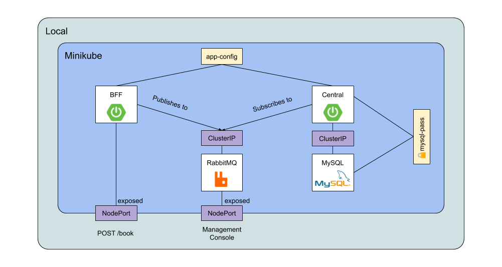

# Skaffold Sample
Sample Spring Boot project deployed on a local k8s cluster with Skaffold.

## Software Requirements
- [Minikube](https://kubernetes.io/docs/setup/learning-environment/minikube/) - was using v1.9.2 (93af9c1e43cab9618e301bc9fa720c63d5efa393)
- [Skaffold](https://skaffold.dev/docs/install/) - was using v1.8.0

## Environment Requirements
- Create a cluster with minikube 

## Adding Jib
I used [Jib](https://github.com/GoogleContainerTools/jib) to create container images for the app. 
See the `plugins` section in the `bff/build.gradle` and `central/build.gradle` file. 

## Running
Run using skaffold:

```
skaffold dev
```

## Hotswap

With `skaffold dev`, your changes are automatically deployed and pushed to the local container registry.
Try updating the controller and see the changes reflected.

## Architecture diagram


